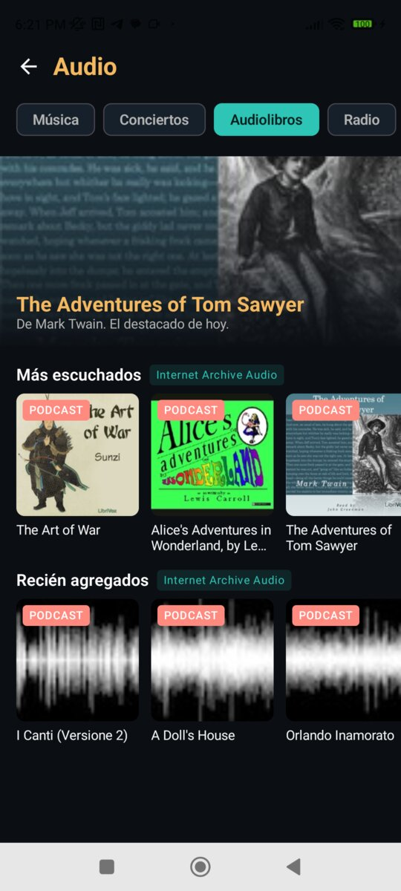
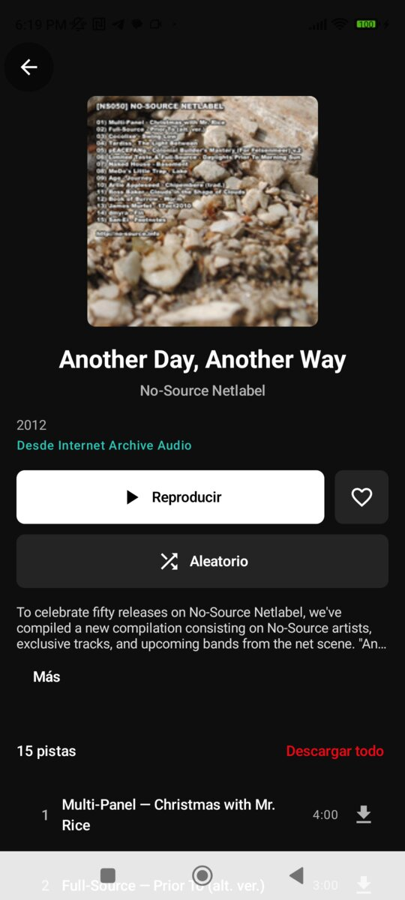
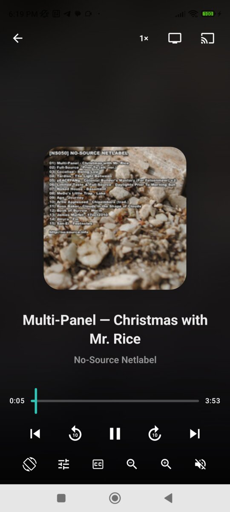
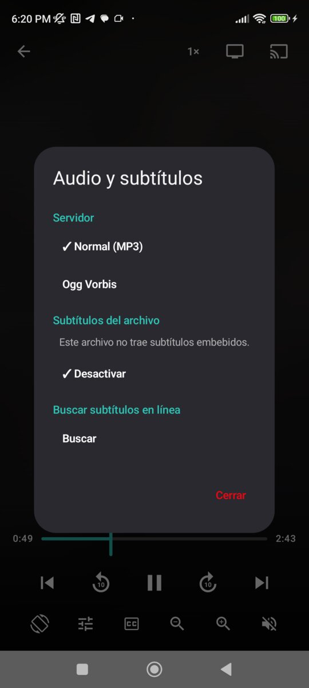
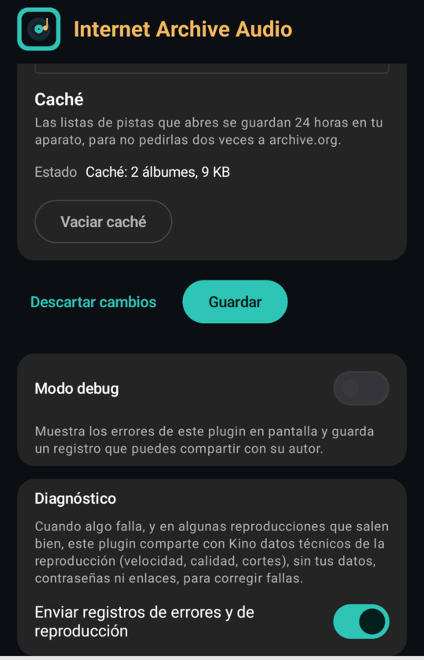

# Internet Archive Audio, a Kino plugin

The reference **audio** plugin for [Kino](https://github.com/kinotvapp/kino-light): free music, live concerts,
audiobooks and old-time radio from the [Internet Archive](https://archive.org), as Kino's `music` and `podcast` items
(SDK `apiVersion` 8, Kino 0.9.54 or newer). One manifest, one JavaScript file, no build step. Read `plugin.js` top to
bottom: it is written to be copied. The video reference is
[`kinotvapp/kino-plugin-archive`](https://github.com/kinotvapp/kino-plugin-archive).

## What it looks like

Kino 0.9.54 on a phone (Redmi Note 9 Pro), with this plugin installed:

<table>
  <tr>
    <td align="center"><br><sub>Its own <b>Audio</b> section: tabs, today's pick, rows</sub></td>
    <td align="center"><br><sub>Audiobooks from LibriVox, as podcasts</sub></td>
    <td align="center"><br><sub>An album: play, shuffle, 15 tracks, download</sub></td>
  </tr>
  <tr>
    <td align="center"><br><sub>The audio player, in the plugin's colours</sub></td>
    <td align="center"><br><sub>Every quality as a lazy copy (Servidor menu)</sub></td>
    <td align="center"><br><sub>Settings: cache status and an action</sub></td>
  </tr>
</table>

<br>
<sub>An audiobook left half-way shows up in <b>Seguir escuchando</b> on Home, and resumes where it stopped.</sub>

## What it does

| Capability / export | How |
| --- | --- |
| `search` | One archive.org search over every enabled collection, by `title` and by `creator` (people search for "Caruso" as often as for an album). What was typed is cleaned of query syntax first. Results are ranked with `kino.rank` and near-misses dropped; Kino's `type` (`music` / `podcast`) only puts that kind first, never filters. |
| `home` | Three rows, each with "Ver más": netlabel albums, audiobooks (in the chosen language) and old-time radio, most played first. The person's extra collection, when set, is a first row, newest first. A row archive.org fails to answer is left out; the others stay. |
| `browse` | "Ver más" for every row, section row and genre tile. Refs are `<scope>:<order>` (`music:top`, `books:new`, `genre-jazz:top`, `extra:new`), 50 per page, the page number as cursor. |
| `episodes` | The tracks of an album, the chapters of an audiobook, the episodes of a radio show: grouped per original file, ordered by disc, then `track`, then name; discs (folders `CD1/`, etree's `d1t01`) become seasons. Answers for every audio item, even a single 78 rpm side (one track), as the contract requires. |
| `resolve` | The track in the person's quality, with every other rendition (MP3, 64 kbps, Ogg, FLAC) as a **labelled lazy copy**: Kino shows them in the player's Servidor menu and resolves one only when it is picked, used as a fallback or chosen for a download. |
| `download` | Declarative: Kino saves what `resolve` returns (progressive audio), on phones. |
| `section` | Its own "Audio" section: tabs Música, Conciertos, Audiolibros and Radio, two or three rows each, and today's pick (the day number chooses it, so everyone sees the same one all day). |
| `categories` | Genre tiles in Kino's Categorías (jazz, classical, electronic, live rock, blues, radio sci-fi and mystery, poetry, children's stories). A genre with nothing in it, or one archive.org fails to answer, is not offered. |
| `settingsStatus`, `action` | The cache's status line and the "Vaciar caché" button. |
| `validateSettings` | Checks the extra collection exists and holds audio before Kino saves the form. |

## Collections and kinds

| Collection | Size (2026-10-06) | Kino kind | One "episode" is |
| --- | --- | --- | --- |
| `netlabels` | ~77k | `music` (album) | each audio file |
| `78rpm` | ~314k | `music` | each side (usually one per item) |
| `etree` | ~305k | `music` (concert) | each song of the set |
| `librivoxaudio` | ~22k | `podcast` (audiobook) | each chapter |
| `oldtimeradio` | ~8.8k | `podcast` | each episode |

Every query ends in `mediatype:(audio OR etree)`: concert items are `etree`, not `audio`, and an item of mediatype
`collection` (a band's page) has nothing to play.

## archive.org quirks it handles

- **Originals and derivatives.** One original file per track (FLAC for etree, VBR MP3 for netlabels and LibriVox,
  128Kbps MP3 for 78rpm); derivatives name it in `original`. `tracksOf()` groups them, so one track offers every format.
- **MP3s named by bitrate.** Besides `VBR MP3`, archive.org labels files `24Kbps MP3` to `320Kbps MP3` (Dragnet's 298
  episodes are 24 and 32 kbps originals). An original is the track's MP3 whatever its bitrate; a derivative of 64 kbps
  or less is the light copy (`renditionOf()`).
- **Private originals.** Many soundboard concerts keep their FLAC original private: it answers 403 to everyone, so it
  names its track but is never offered as a copy (`isPrivate()`).
- **Inconsistent fields.** `track` is `"1/15"`, `"03"` or missing; `length` is seconds (`"240.9"`) or `"10:40"`;
  `creator` may be a list. `seconds()`, `text()` and `tracksOf()` normalize them.
- **Titles that are file names.** LibriVox titles like `wonderland_ch_01` become "Capítulo 1" / "Chapter 1"; anything
  else is rebuilt from the file name, where radio shows keep the episode's title (`XMinusOne55-04-24001NoContact.mp3` →
  "X Minus One55-04-24001 No Contact") and untitled 78 rpm sides get theirs (`Caruso-AddioAllaMadre.mp3` → "Addio Alla
  Madre"); a name with no word in it becomes "Episodio N" / "Pista N". See `finishTracks()`.
- **Compilations.** When the tracks have more than one artist, each title starts with its own.
- **Busy answers.** archive.org sometimes answers 200 with an HTML page or a JSON `error`: `getJson()` turns both into
  `unavailable` with a sentence the person understands.
- **Query syntax.** A stray `/ - & '` or a dangling `AND`/`OR`/`NOT` makes archive.org answer an error: `cleanText()`.

## Settings

| Setting | What it does |
| --- | --- |
| Calidad | Normal (MP3), Liviana (64 kbps) or Sin pérdida (FLAC): what plays first and what downloads. A missing rendition falls back to the next and is reported (`kino.log.report`, area `quality_fallback`). |
| Idioma de los audiolibros | Narrows LibriVox only: Spanish, English, Italian or Portuguese (French and German have almost nothing). |
| Conciertos en vivo | Off removes `etree` everywhere: search, Home, the Conciertos tab and the live-rock tile. |
| Colección extra | An archive.org collection identifier or its `https://archive.org/details/<id>` address. It is a `text` setting, not a `url` one: a `url` setting adds a host, and archive.org is already declared. Its items take their kind from their own collections (a LibriVox item is a podcast), and are music otherwise. |
| Estado / Vaciar caché | How many albums the cache holds, and a button to empty it (with a confirmation). |

## Hosts, and why `*.archive.org`

The manifest declares `archive.org` **and** `*.archive.org`. A download URL on `archive.org` redirects to a storage
node such as `dn601307.us.archive.org`, and a wildcard does not cover its own bare domain.

## Lessons for your own plugin

- **Never cache a localized text.** The cache holds archive.org's own titles and nothing translated; "Capítulo 3" or
  "Episode 7" is written per call in the person's language (`kino.lang`), so switching Kino's language never shows
  yesterday's. The cache key is versioned (`meta1:`): a release that changes what is cached bumps it.
- **An error sentence Kino will show.** Kino hides a `userMessage` that names a domain or the app and shows its own
  generic line instead: "El archivo no responde ahora", never "archive.org no responde". The kit's `run.mjs` prints
  what the person reads; `test/quirks.test.mjs` checks every sentence with the kit's `shownSentence`.
- **A cache never fails its call.** `kino.storage` holds 256 KB in all: an item over 48 KB (a radio show with 500
  episodes) is simply not cached, and a full storage gives up its oldest album.
- **Mind the fetch limits.** Kino allows 6 fetches in flight and 60 per call: `mapLimit()` keeps rows and genre tiles
  under that.
- **One failure, one row.** Each row and each tile has its own `try/catch` and a `kino.log` line.
- **`type` is a hint.** Order by it; never filter by it.
- **Lazy copies, not eager ones.** Listing the other qualities as `{ label, ref }` costs nothing until someone picks one.
- **Report degraded results** with `kino.log.report` (needs `"telemetry": true`): the author hears about them.
- **`"debug": false` in a published manifest.** `true` switches "Modo debug" on for everyone who installs it: use it
  only on a build you hand to a tester.
- **Test offline.** `test/harness.mjs` fakes archive.org for the behaviour tests; `test/tapes/` holds real answers,
  replayed by `test/live.test.mjs`.

## What it does not do

| Not here | Why |
| --- | --- |
| `tracking`, `segments`, `subtitles`, `meta` | Their contracts are for movies and episodes with IMDb/TMDB ids; this audio has none, so Kino would never ask. |
| `migrate` | Nothing to move yet. It would be needed if a future version changed the shape of its refs (`item:`, `track:`). |
| Skipping LibriVox's spoken disclaimer | Its length varies and archive.org does not publish it; a guessed `skip` would be false data. |
| `browser`, request `signing`, `streamHosts`, `secrets` | archive.org is open: no pages to render, nothing to sign, no keys. |
| Marketplace `categories` | The manifest field has no music or podcast value yet, so it is left out. |

## Test it

You need Node 18 or newer. Kino's kit is the `sdk/` folder of this repository (in Kino's own repository it is
`plugins/sdk`, next to this plugin's folder: the tests find it in either place).

```
node --test test/*.test.mjs                 # behaviour (fake archive.org) and the recorded tapes
node sdk/run.mjs . episodes item:NS050      # one call against the real archive.org
node sdk/validate.mjs .                     # the manifest, as Kino checks it
node test/record.mjs                        # re-record the tapes (network)
```

## Build an audio plugin like this one with an AI

Copy this prompt into an AI coding assistant that can use a terminal (Claude Code, Codex, Gemini CLI, Cursor,
Copilot in agent mode…), change what is between `<<<` and `>>>`, and it will build, test and publish a music or
podcast plugin for Kino with you, even if you cannot program.

```text
You are going to write a Kino plugin for music or podcasts: a public GitHub repository with kino-plugin.json and
one JavaScript ES module (plugin.js) that the Kino app runs in a QuickJS sandbox, using SDK apiVersion 8 (items
of kind "music" and "podcast", Kino 0.9.54 or newer).

I may not know how to program. Explain each step in plain words, run the commands yourself (tell me first which
one and why), ask me before anything that cannot be undone (deleting, publishing, pushing to GitHub) and, when I
have to do something on GitHub or in Kino, give me the exact clicks.

Before writing anything:
1. Read https://kinotvapp.github.io/kino-plugins/AGENTS.md completely and follow it as your instructions.
2. Read https://kinotvapp.github.io/kino-plugins/llms-full.txt (the whole guide, contract.json and kino.d.ts),
   especially "Music and podcasts (apiVersion 8)". If you cannot open URLs, tell me and I will paste them.
3. Read https://github.com/kinotvapp/kino-plugin-archive-audio completely (plugin.js, kino-plugin.json,
   README.md, test/): it is the reference audio plugin. Copy its structure: the ten blocks of plugin.js, the
   { es, en } texts chosen by kino.lang, tracks grouped per original file, discs as seasons, every quality as a
   lazy labelled copy, a kino.storage cache that never fails its call and never holds translated text, and
   offline tests with a fake source plus recorded tapes. Do not copy its archive.org code for another source.

What I want:
- Source: <<< the site or API with the audio, e.g. https://example.com >>>
- Content: <<< music albums / live concerts / podcasts / audiobooks / radio shows; language >>>
- Do I have the right to use it: <<< yes, it is free or mine / not sure (then stop and tell me) >>>
- Access: <<< none / an account of mine / an API key of mine I do not want to publish >>>
- What Kino asks the person when setting it up: <<< nothing / their account / their preferred language >>>
- Offline downloads: <<< yes / no >>>
- Its own section in Kino with tabs, and genre tiles in Categorías: <<< yes / no >>>
- Name in Kino and a short description: <<< e.g. "Mi radio": "Podcasts de …, en español" >>>
- Sign the plugin with my own key: <<< yes / no >>>
- My GitHub user: <<< e.g. my-user >>>

Rules on top of AGENTS.md:
- "apiVersion": 8. An album, playlist or single track is "music"; a podcast, audiobook or radio show is
  "podcast". With the "episodes" capability, episodes(ref) must answer for every audio item, even a single track
  (one entry). Put the artist or host in "artist".
- Every text the person reads goes in Spanish and English, chosen by kino.lang.
- Test every function with the kit (sdk/run.mjs, sdk/validate.mjs) and with node --test before telling me it
  works; then I try it on my phone or TV: albums play in order, next and previous work, a podcast resumes where I
  left it.
```

```text
Vas a escribir un plugin de Kino para música o podcasts: un repositorio público de GitHub con kino-plugin.json y
un módulo JavaScript (plugin.js) que la app Kino ejecuta en un sandbox QuickJS, con el SDK apiVersion 8 (elementos
de tipo "music" y "podcast", Kino 0.9.54 o más nuevo).

Puede que yo no sepa programar. Explícame cada paso con palabras sencillas, ejecuta tú los comandos (dime antes
cuál y para qué), pregúntame antes de cualquier cosa que no se pueda deshacer (borrar, publicar, subir a GitHub)
y, cuando yo tenga que hacer algo en GitHub o en Kino, dame los clics exactos.

Antes de escribir nada:
1. Lee completo https://kinotvapp.github.io/kino-plugins/AGENTS.md y síguelo como tus instrucciones.
2. Lee https://kinotvapp.github.io/kino-plugins/llms-full.txt (la guía completa, contract.json y kino.d.ts),
   sobre todo "Music and podcasts (apiVersion 8)". Si no puedes abrir direcciones, dímelo y te las pego.
3. Lee completo https://github.com/kinotvapp/kino-plugin-archive-audio (plugin.js, kino-plugin.json, README.md,
   test/): es el plugin de audio de referencia. Copia su estructura: los diez bloques de plugin.js, los textos
   { es, en } elegidos por kino.lang, las pistas agrupadas por archivo original, los discos como temporadas, cada
   calidad como copia diferida con etiqueta, una caché en kino.storage que nunca hace fallar la llamada ni guarda
   texto traducido, y pruebas sin red con una fuente falsa más grabaciones reales. No copies su código de
   archive.org para otra fuente.

Lo que quiero:
- Fuente: <<< el sitio o la API con el audio, p. ej. https://example.com >>>
- Contenido: <<< álbumes / conciertos en vivo / podcasts / audiolibros / radio; idioma >>>
- ¿Tengo derecho a usarla?: <<< sí, es libre o es mía / no estoy seguro (entonces detente y dímelo) >>>
- Acceso: <<< ninguno / una cuenta mía / una llave de API mía que no quiero publicar >>>
- Qué le pregunta Kino a la persona al configurarlo: <<< nada / su cuenta / su idioma preferido >>>
- Descargas sin conexión: <<< sí / no >>>
- Sección propia en Kino con pestañas y mosaicos por género en Categorías: <<< sí / no >>>
- Nombre en Kino y una descripción corta: <<< p. ej. "Mi radio": "Podcasts de …, en español" >>>
- Firmar el plugin con mi propia llave: <<< sí / no >>>
- Mi usuario de GitHub: <<< p. ej. mi-usuario >>>

Reglas además de AGENTS.md:
- "apiVersion": 8. Un álbum, una lista o una canción suelta es "music"; un podcast, un audiolibro o un programa
  de radio es "podcast". Con la capacidad "episodes", episodes(ref) debe responder para todo elemento de audio,
  incluso una canción suelta (una sola entrada). Pon el artista o el presentador en "artist".
- Todo texto que lee la persona va en español y en inglés, elegido por kino.lang.
- Prueba cada función con el kit (sdk/run.mjs, sdk/validate.mjs) y con node --test antes de decirme que
  funciona; después yo lo pruebo en mi teléfono o mi TV: los álbumes suenan en orden, siguiente y anterior
  funcionan, y un podcast retoma donde lo dejé.
```

## Install

In Kino, Ajustes ▸ Plugins, type `kinotvapp/kino-plugin-archive-audio`.

## License

The code is MIT (see `LICENSE`). The audio and images belong to their items on archive.org: public domain, or each
item's own licence (netlabel releases are usually Creative Commons; read the item's page).
